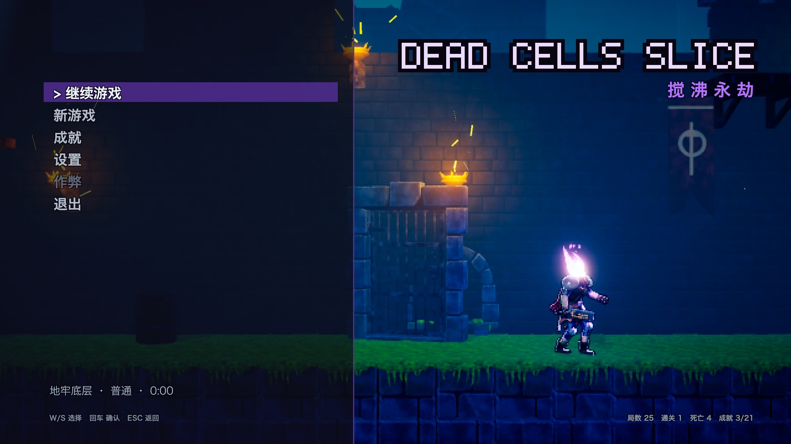
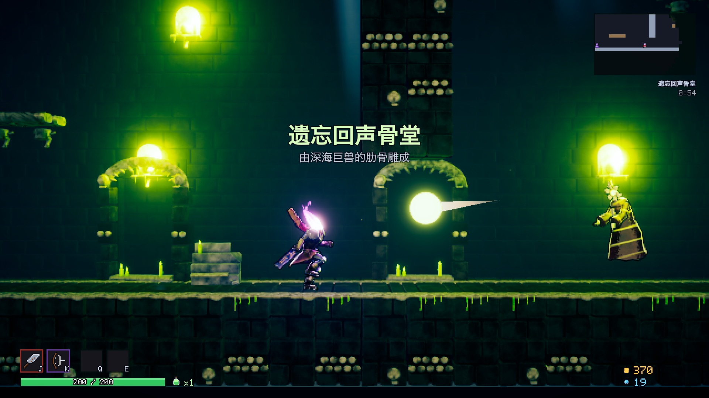
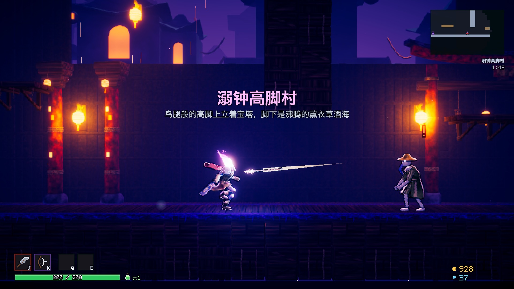
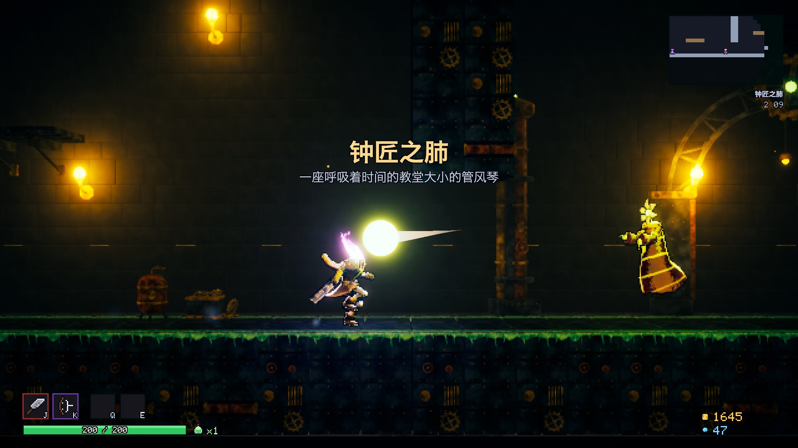
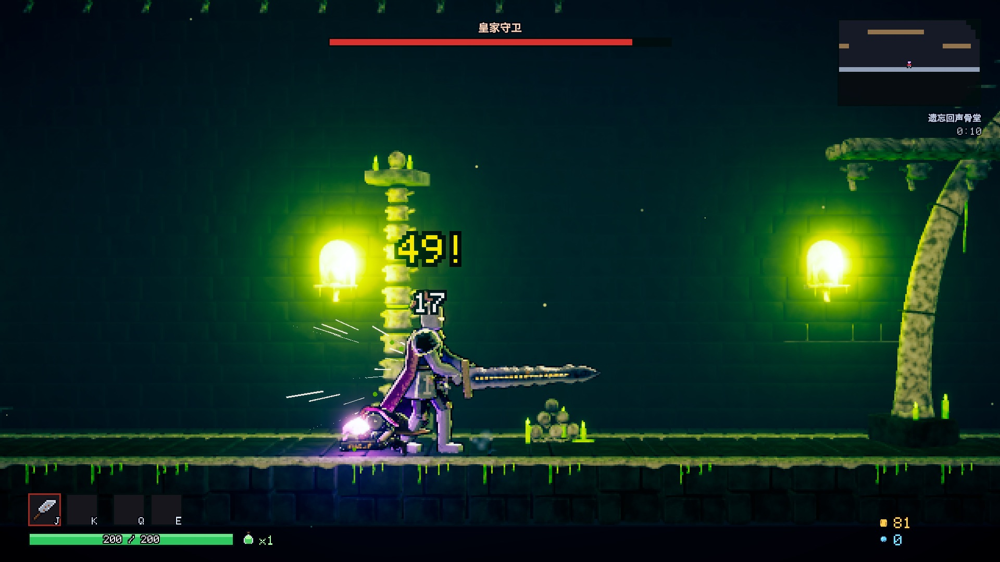
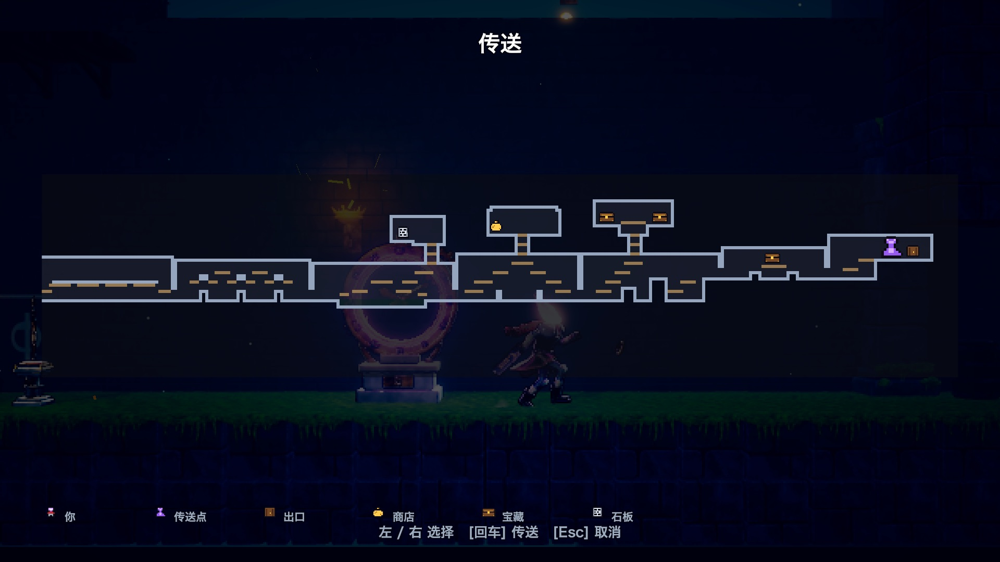
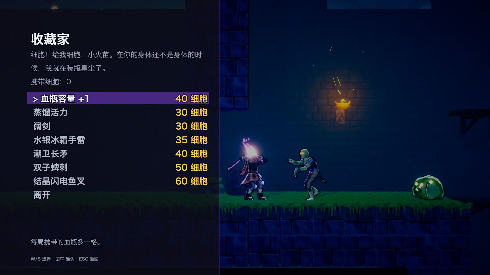

# Dead Cells Slice — 搅沸永劫（The Churning）

用 Blender（Python 程序化建模、绑定、动画、烘焙）+ Unity 6 URP（自定义卡通 shader、像素化 Render Feature、手感系统）做的《Dead Cells》风格横版 Roguelite。剧情取自《The Churning》设定：余烬血块附身无头囚犯，从地牢底层一路向上，穿过四个区域，直到钟匠之肺的时间守护者。

所有美术资产都由脚本生成，关卡在运行时由房间模板拼出，整个项目可一键重建。



| | |
|---|---|
|  |  |
|  |  |
|  |  |

## 直接玩

```bash
open "Builds/DeadCellsSlice.app"
```

（`Builds/` 不进 git；没有时先按下面「重建」生成。）

| 操作 | 键盘 / 鼠标 | 手柄 |
|---|---|---|
| 移动 | A / D 或 ← → | 左摇杆 / 十字键 |
| 跳跃（按住更高；撞墙时自动攀上边缘） | Space | A |
| 主武器 / 副武器 | J 或左键 / K 或右键 | X / Y |
| 技能 1 / 技能 2 | Q / E | LT / RT |
| 翻滚（无敌帧） | Shift 或 L | B |
| 交互（拾取、购买、开箱、传送、阅读） | F | LB |
| 血瓶 | R | RB |
| 地图 | Tab 或 M | View |
| 暂停 | Esc | Menu |
| 下砸 / 穿过木平台 | 空中 S + Space / 站在平台上 S + Space | 下 + A |

盾牌按住格挡，举起后 0.2 秒内被击中为完美格挡（眩晕敌人、反弹投射物）。

## 游戏内容

- **主菜单**：继续、新游戏、成就、设置、作弊（解锁后）、退出。设置里可切换 **中文 / English**、屏幕震动、火焰颜色、全屏、跳过序章，以及重置进度。
- **流程**：地牢底层 → 悬月长廊 → 遗忘回声骨堂（Boss：皇家守卫）→ 溺钟高脚村 → 钟匠之肺（最终 Boss：时间守护者）。区域之间是水闸通道，有收藏家和泉水。
- **关卡**：每次进入区域时，用 46 个手写房间模板（含镜像）随机拼出约 16–22 个房间。主路线左右延伸、高低起伏，侧室（商店、宝藏、石板、精英）通过竖井挂在上下方。
- **难度**：开局选简单 / 普通 / 困难。用某个 Boss 细胞等级击败时间守护者后，解锁下一级 Boss 细胞，最多 4 级。等级越高，敌人越强、精英越多，泉水回复越少。
- **存档**：每次进入区域时自动存档，主菜单「继续」从当前区域入口开始。死亡后本局结束，未花掉的细胞和金币清零。收藏家处的解锁、成就和统计永久保留。
- **商店与收藏家**：商人用金币卖装备。精英、Boss、宝箱会掉落图纸，在通道里交给收藏家并花细胞解锁，之后才会出现在掉落和商店里；收藏家也卖血瓶容量和永久生命。
- **传送点（同 Dead Cells）**：靠近石像就会点亮，同时标进地图。在石像旁按交互打开地图，选另一座已点亮的石像就能传送。地图有战争迷雾，标出你、传送点、出口、商店、宝藏和石板。
- **剧情**：序章（大蒸馏、时序之神的断齿、余烬血块的诞生）、苏醒字幕、区域标题与引言、13 块碎裂石板、NPC 与 Boss 台词、死亡画面「无药可救的轮回」，以及击败时间守护者后的结局。
- **成就**：21 个，覆盖探索、Boss、Boss 细胞、困难通关、无伤区域、速通、收集、石板、传送和死亡次数。用过作弊的那一局不能解锁成就。
- **作弊**：在主菜单直接键入 `CHURN` 解锁作弊菜单，可开无敌、一击必杀、无冷却，加金币和细胞，回满，显示全地图，跳关，解锁全部图纸或全部 Boss 细胞。

### 装备

| 类型 | 物品 |
|---|---|
| 近战 | 锈蚀的刽子手砍刀（初始）、生锈的剑、阔剑、潮卫长矛、双子蜱刺（背刺暴击） |
| 盾 / 弓 | 前线盾牌、尖刺弓（远距离暴击，会被兰灯僧侣反弹） |
| 技能 | 硫磺手雷（燃烧）、水银冰霜手雷（冻结，冻住的敌人吃暴击）、结晶闪电鱼叉（贯穿 + 感电） |
| 消耗 | 生命血瓶、力量 / 活力卷轴 |

### 敌人

溺亡囚徒、钟针哨兵、兰灯僧侣（倒唱经文，把你的投射物反弹回来）、鳗舌渔民（闪电鱼叉、扑跳）、腐蚀害虫（自爆）、薄翼蜱虫（俯冲）、苔藓贫民、歌唱方尖碑（音波炮台），还有精英变体。两个 Boss：

- **皇家守卫**：重劈，带向两侧扩散的冲击波；横扫；半血以下连招。
- **时间守护者**：三个阶段，包括铲击、星光抛射、地面星光柱、召唤蜱虫，以及「倒流六十秒」。倒流会给自己回血、把你拉回 3 秒前的位置，读条时打出足够伤害就能打断。

### 预计时长

一次成功通关约 1.5–2 小时：5 个区域、约 100 个房间、2 个 Boss，按每个房间 1 分钟左右估算。普通难度下，第一次通关通常要先失败几局，靠收藏家的永久成长和图纸解锁变强，所以首次通关总时长约 4–6 小时，设计目标是 5 小时。这是按关卡规模和战斗数值推算的，没有经过真人试玩校准。参考数据：不会闪避的测试机器人在普通难度下通过了第一个区域，在第二个区域中途死亡。

## 目录

| 路径 | 内容 |
|---|---|
| `Tools/Blender/` | 资产生成脚本：角色 `build_beheaded.py`、`build_zombie.py`、`build_enemies.py`（哨兵、僧侣、渔民、两个 Boss、生物），武器 `build_weapons.py`、`build_arsenal.py`，道具 `build_props.py`，环境 `build_environment.py`、`build_biome.py`（四个区域套件） |
| `Tools/PIPELINE.md`、`Tools/BIOMES.md` | Blender → Unity 资产约定、区域套件约定 |
| `Tools/Rooms/` | 房间模板（`make_rooms.py` 按坐标定义）和两个校验器：单房间（含镜像）可达性 `validate_rooms.py`，整关可达性 `validate_levels.py` |
| `Assets/_Project/Art/` | 导出的 FBX 与烘焙贴图 |
| `Assets/_Project/Resources/` | 房间模板、中英文字符串表、物品库、世界预制体表 |
| `Assets/_Project/Scripts/Runtime/` | `Player/` 移动与战斗、`Enemies/` 敌人与 Boss、`Items/` 物品与投射物、`Run/` 关卡生成与流程、`Meta/` 存档 / 成就 / 难度 / 作弊 / 本地化、`UI/` 菜单与 HUD |
| `Assets/_Project/Scripts/Editor/` | 一键配置项目，生成材质 / 预制体 / 物品 / 区域 / 场景，打包 |

## 重建

1. Blender 资产（headless，每个脚本几分钟到十几分钟）：

```bash
/Applications/Blender.app/Contents/MacOS/Blender -b --factory-startup -P Tools/Blender/build_biome.py -- --biome all
```

其它脚本同理（`build_arsenal.py`、`build_props.py` 加 `-- --res=640`；敌人见 `build_enemies.py` 里的 `build(name)`）。

2. 改了房间以后，先跑两个校验：

```bash
python3 Tools/Rooms/make_rooms.py && python3 Tools/Rooms/validate_rooms.py
```

```bash
~/.unity/bin/unity run . --no-tail -l Logs/dump.log -- -executeMethod DeadCells.EditorTools.DCBatch.DumpLevels && python3 Tools/Rooms/validate_levels.py
```

3. 配置 Unity、生成内容和场景、打包 macOS 版，并跑一遍自动验证：

```bash
zsh Tools/build_and_capture.sh check --seconds 120 -- -autoplayMenu -autoplayGod -autoplaySkip 20
```

截图和日志在 `Captures/check/`。

## 自动验证参数

`-autoplay` 会启动一个跨场景的测试机器人，按地形图寻路、战斗、喝血瓶、走出口。常用参数：

| 参数 | 作用 |
|---|---|
| `-autoplaySeconds N`、`-captureInterval N` | 运行时长、截图间隔 |
| `-autoplayMenu` | 先截主菜单各页面 |
| `-autoplayBiome N`、`-autoplayDifficulty easy\|normal\|hard` | 从第 N 个区域开始、难度 |
| `-autoplayGod`、`-autoplaySkip N` | 无敌、每 N 秒跳到下一区域（巡视全部区域与结局） |
| `-autoplayWarpBoss` | 直接传送到 Boss 场地 |
| `-autoplayUiTour`、`-autoplayDie` | 依次打开暂停、地图、收藏家、传送、商店购买、石板并截图；最后测试死亡画面 |
| `-autoplayLang en\|zh`、`-autoplayNoVsync` | 语言、关闭垂直同步（测真实帧率） |

日志 `autoplay_log.txt` 记录每个区域的房间数和敌人数、报错计数、平均帧率、最差帧、CPU/GPU 帧时间。
