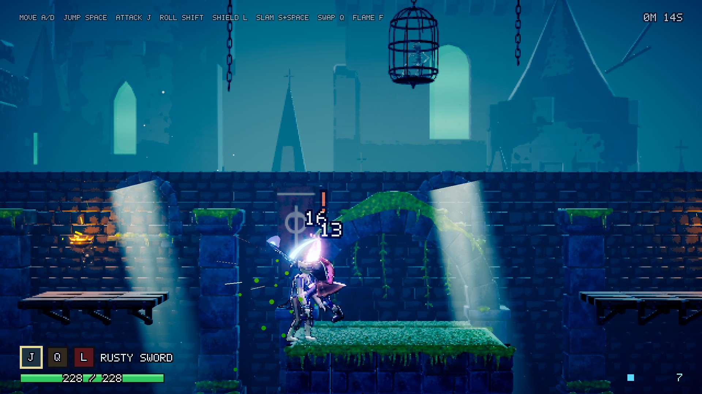
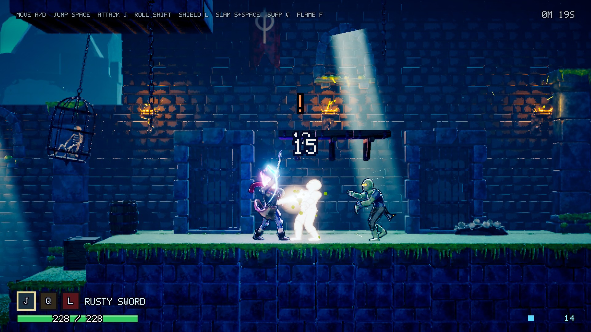

# Dead Cells Slice — Prisoners' Quarters 垂直切片

用 Blender（Python 程序化建模/绑定/动画/烘焙）+ Unity 6 URP（自定义卡通 shader、像素化 Render Feature、手感系统）复刻《Dead Cells》开场区域的画面风格与战斗手感。所有资产都由脚本生成，可一键重建。





## 直接玩

```bash
open "Builds/DeadCellsSlice.app"
```

（`Builds/` 不进 git；没有时先按下面「重建」生成。）

| 操作 | 键盘 | 手柄 |
|---|---|---|
| 移动 | A / D 或 ← → | 左摇杆 / 十字键 |
| 跳跃（按住更高） | Space | South |
| 攻击（连击 3 段） | J 或 鼠标左键 | West |
| 翻滚 / 空中冲刺（无敌帧） | Shift 或 K | East / RT |
| 举盾（刚举起 0.18 秒内为弹反） | L 或 鼠标右键 | LB / LT |
| 下砸 | 空中 S + Space | 下 + South |
| 下穿木平台 | S + Space（站在木平台上） | 下 + South |
| 切换武器（生锈剑 / 大剑） | Q | North |
| 切换火焰颜色（神秘紫 / 毒绿 / 余烬橙） | F | Select |

## 画面与手感要点

- **3D → 像素**：角色、武器、环境都是带 PBR 贴图的 3D 网格；`PixelateRenderFeature` 在透明物体之前把不透明画面按整数倍缩到 360p 再放大，粒子、斩击弧光、烟雾和 Bloom 保持高分辨率叠在像素画上。相机按低分辨率像素网格对齐，余量以亚像素偏移交给放大 pass，滚动不抖。
- **卡通光照**（`Shaders/DeadCellsLighting.hlsl`）：2–3 段色阶 + 阴影色偏、硬边金属高光、朝上偏置的 Fresnel 边缘光、每盏点光源的彩色边缘光、法线贴图参与 Forward+ 所有点光源、`_Time.y` 驱动的自发光脉动。
- **火焰头**：顶点色（热度 / 摆动权重 / 相位）驱动顶点摆动、上升噪声裁切和分段热度渐变；跑动时火焰向后拖。
- **手感**（`JuiceEngine`）：命中时 `Time.timeScale = 0` 冻结 40–80 ms；Cinemachine Impulse 方向性冲击 + trauma 噪声（平方衰减）；斩击弧光沿肩部插值成新月形；挤压拉伸；火花、体液、伤害数字。
- **敌人**：僵尸巡逻 → 发现 → 抬手预警（全身橙光 + “!”）→ 扑击；攻击中霸体，被弹反会眩晕，死亡后爆出细胞。

## 目录

| 路径 | 内容 |
|---|---|
| `Tools/Blender/` | 资产生成脚本（共用库 `dc_common.py`、`dc_rig.py`；`build_beheaded.py`、`build_zombie.py`、`build_weapons.py`、`build_environment.py`） |
| `Tools/PIPELINE.md` | Blender → Unity 资产约定（坐标轴、骨骼命名、贴图规则） |
| `Tools/Blend/` | 生成后的 .blend 存档 |
| `Assets/_Project/Art/` | 导出的 FBX 与烘焙贴图 |
| `Assets/_Project/Shaders/` | 卡通光照、火焰、烟雾、斩击弧光、光柱、粒子、像素化 shader |
| `Assets/_Project/Scripts/Runtime/` | 玩法：`PlayerController`、`PlayerCombat`、`JuiceEngine`、`ZombieEnemy`、HUD、环境行为 |
| `Assets/_Project/Scripts/Editor/` | 一键配置项目、生成材质/预制体/关卡、打包 |
| `Assets/_Project/Scenes/PrisonersQuarters.unity` | 关卡场景（由 `DCSceneBuilder` 生成） |

## 重建

1. 重新生成 Blender 资产（headless，每个 2–4 分钟）：

```bash
/Applications/Blender.app/Contents/MacOS/Blender -b --factory-startup -P Tools/Blender/build_beheaded.py
```

把脚本名换成 `build_zombie.py`、`build_weapons.py`、`build_environment.py` 即可生成其它资产。

2. 配置 Unity 项目、生成内容和场景、打包 macOS 版，并跑一遍自动演示截图：

```bash
Tools/build_and_capture.sh check
```

截图和运行日志在 `Captures/check/`。只想在 Unity 里重建，可以用菜单 **Dead Cells → Setup**。

## 自动演示 / 验证模式

```bash
"Builds/DeadCellsSlice.app/Contents/MacOS/Dead Cells Slice" -autoplay -captureDir Captures/demo -autoplaySeconds 26
```

先按脚本演示全部动作，再由一个简单 AI 自动推图；按间隔截图，结束后自动退出，并在截图目录写 `autoplay_log.txt`（含报错计数和帧率）。
